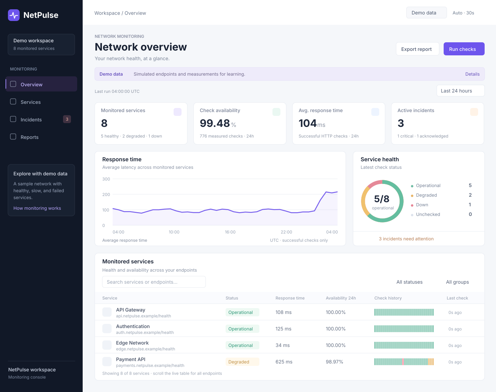

# NetPulse — Network Service Monitoring Dashboard

A working React and JavaScript monitoring project with service health, response-time charts, check-based availability, automatic incident tracking, and CSV reports. Includes demo simulation, real server-side HTTPS probes, responsive CSS, and SVG design references you can import into Figma.

## What works

- Overview with monitored-service counts, successful-check percentage, average latency, and active incidents.
- Service search, status/group filters, 1-hour / 6-hour / 24-hour reporting windows, and service-detail panels.
- Check history with healthy, slow, failed, and unobserved intervals.
- Manual checks and optional 30-second checks while the page is open and visible.
- Demo mode with eight simulated services; add and pause/resume demo services.
- Live mode with server-configured public HTTPS targets. The browser sends target IDs, never arbitrary URLs.
- Automatic incident opening, acknowledgement, severity changes, and recovery closure.
- Browser-local history and separate saved workspaces for demo and live mode.
- CSV reports with spreadsheet-formula escaping.

## Publish the full app on a free server

Upload the files inside `NetPulse` to your GitHub repository, then create a **Blueprint** in [Render](https://dashboard.render.com/) and connect that repository. The included `render.yaml` selects a **Free Node.js web service**, builds the React frontend, and starts the monitoring API. Keep `package.json` and `render.yaml` at the repository root.

After a successful deployment, Render supplies the actual HTTPS address ending in **`onrender.com`**. Copy that address from your service dashboard; this project does not invent a deployed URL.

Both **Demo data** and **Live HTTP** work online. Render's free service sleeps after 15 minutes without incoming traffic; reopening it can take about a minute. See [the free server guide](docs/FREE_HOSTING.md) for deployment steps and the current free-plan limits.

## Start the downloadable GitHub project

The downloadable archive uses React + Vite and a small Node.js HTTP server. The same server runs locally and on Render.

1. Install Node.js **24 LTS** (Node 22.13+ is also supported).
2. Extract `NetPulse_Full_Project.zip` and open its `NetPulse` folder in VS Code.
3. Open **Terminal → New Terminal**, then run:

```bash
npm install
npm run dev
```

4. Open **http://localhost:5173**. Demo mode works without accounts or paid services.
5. Click **Run checks**, open a service, acknowledge an incident, and export a report.
6. Select **Live HTTP**, then **Run checks** to measure the configured public endpoints.

```bash
npm test        # meaningful rule and HTTP-probe tests
npm run build  # production browser bundle
npm start      # serve the production bundle and API at localhost:3001
```

See [the setup guide](docs/SETUP.md) for Windows, GitHub upload, target configuration, and troubleshooting.

## Technology

| Area | Used here |
| --- | --- |
| UI | React, JavaScript / JSX, semantic HTML |
| Styling | CSS, Tailwind compilation for the included UI primitives |
| Controls | Radix UI primitives, Sonner notifications, Lucide icons |
| Charts | SVG with actual sample aggregation and gaps for missing data |
| API and production server | Node.js built-in HTTP server and Fetch API |
| Free hosting | Render Node.js web service, configured in render.yaml |
| Persistence | Device-local browser storage |
| Design | Desktop/mobile SVG reference layouts and JSON design tokens, importable into Figma |
| Verification | Node.js test runner and production build |

## Monitoring definitions

- **Operational:** HTTP 2xx response at or below the target's latency threshold.
- **Degraded:** successful response above the threshold.
- **Down:** non-2xx response, network error, or 5-second timeout.
- **Availability:** successful measured checks ÷ all measured checks × 100. Slow but successful responses count as available.
- **Average latency:** mean header-response time for successful checks only; not the time to download an entire page.
- **No checks:** unknown data, shown as gray. Missing time is never filled with invented successful measurements.

This is a learning project. It checks HTTP endpoints; it does not perform ICMP ping, TCP-port scans, packet-loss measurement, or real DNS probes. Demo service names describe a sample network; all `.example` addresses are simulated labels. Checks stop when the page closes, and browser history is not shared across devices. Availability is sample-based rather than a time-weighted SLA calculation. Pausing a service stops new samples; retained historical checks remain in reports.

## Documentation and design

- [Setup and GitHub guide](docs/SETUP.md)
- [Free server deployment](docs/FREE_HOSTING.md)
- [Architecture and API](docs/ARCHITECTURE.md)
- [Test cases and evidence](docs/TESTING.md)
- [Interview walkthrough](docs/INTERVIEW.md)
- [Figma import and design guide](design/FIGMA_GUIDE.md)



No native `.fig` file is claimed: the included SVGs are editable import assets. Use the Figma guide to turn them into frames and reusable components.

## License

MIT. Included UI primitives follow their upstream MIT licensing; see `THIRD_PARTY_NOTICES.md`.
