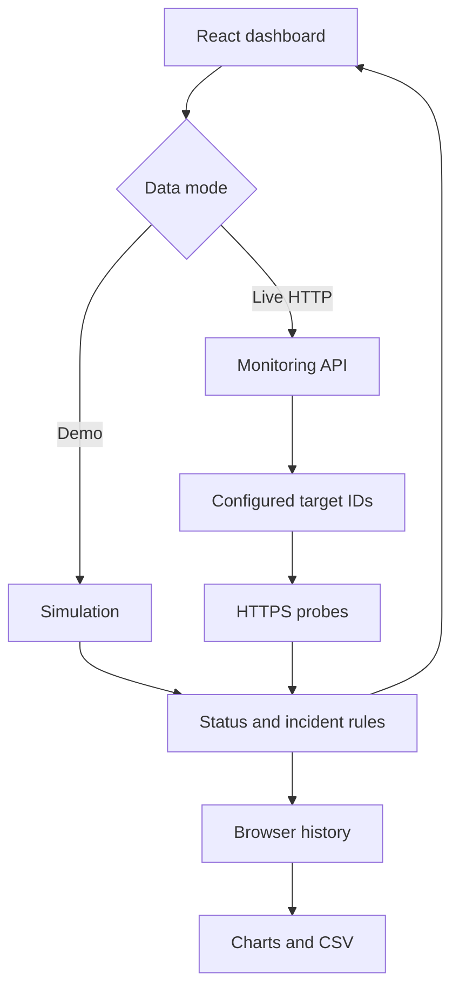

# NetPulse architecture and API

## Product flow

React keeps the workspace state. The UI uses pure JavaScript monitoring rules in `lib/netpulse/model.js`. Demo checks return simulated samples; live checks use the API. Samples update service status, bounded history, incident state, and report metrics. Separate demo/live workspaces are saved in browser-local storage.



## Source layout in the downloadable edition

```text
NetPulse/
  index.html
  package.json
  package-lock.json
  vite.config.js
  src/
    main.jsx
    App.jsx
    styles.css
  components/
    netpulse/charts.jsx
    ui/                       # accessible reusable controls
  hooks/use-mobile.js
  lib/
    utils.js
    netpulse/model.js
    netpulse/probe.js
  server/index.js             # API and production static server
  render.yaml                 # Free Render web-service configuration
  scripts/dev.mjs             # starts Vite and API together
  tests/model.test.js
  design/                    # desktop/mobile SVG and tokens
  docs/
  .github/workflows/ci.yml
```

Render runs the same Node server used by `npm start`. It serves the built React files and the monitoring API from one HTTPS origin. The server honors `PORT`, binds to `0.0.0.0` in production, and uses Render's `RENDER_EXTERNAL_URL` for browser-origin validation because Render terminates TLS before forwarding HTTP.

## API

### `GET /api/health`

Returns `{"status":"ok"}` with HTTP 200. Render uses this endpoint to check that the server is running.

### `GET /api/targets`

Returns configured live targets:

```json
{"targets":[{"id":"example","name":"Example Website","url":"https://example.com/","group":"Public endpoints","thresholdMs":1500}]}
```

### `POST /api/checks`

Request:

```json
{"ids":["example"]}
```

Response:

```json
{"source":"http","checkedAt":1791172800000,"checks":[{"id":"example","ok":true,"latencyMs":92,"httpStatus":200,"checkedAt":1791172800000,"error":null}]}
```

The numbers above illustrate the schema; they are not claimed as a measured request. IDs must match the server's approved target list. Unknown IDs, empty lists, oversized lists, and invalid JSON receive 400. Request bodies above 4 KB receive 413. Cross-origin POST requests receive 403. Invalid target configuration prevents server startup.

HTTP requests use GET with a 5-second abort timeout and manual redirect handling. Response bodies are cancelled after headers arrive to avoid downloading full pages. A small 10-second in-process cache coalesces repeated identical batches. This cache is best-effort within one server instance, not a durable global rate limiter.

## State and incident lifecycle

A service records identity, endpoint, group, latency threshold, enabled flag, latest check, and bounded sample history. Histories are capped at 2,880 samples per service. Sample-based availability uses only observed checks within the selected window. Successful slow checks count as available.

A slow or failed sample opens an automatic incident if no active incident exists for that service. Further failures update severity instead of duplicating incidents. Acknowledgement records that someone is investigating. A healthy recovery closes an automatic active incident. The user cannot fabricate recovery by manually marking a still-failed service healthy.

## Security and privacy choices

- Probe URLs come from trusted server configuration, never an arbitrary URL supplied in a browser request.
- HTTPS-only configuration, no embedded credentials, no literal IPs, no common internal hostnames, no nonstandard ports, and no followed redirects.
- These constraints reduce unsafe target selection; an operator must still trust configured domains and their DNS destinations.
- Network exception details are replaced with bounded messages; no stack traces are sent to the browser.
- React renders service names and notes as text, without `dangerouslySetInnerHTML`.
- CSV fields are quoted and formula-like values are prefixed to prevent formula execution when opened in spreadsheet software.
- No keys or personal data are required. `.env` is excluded from version control.
- Browser storage may fail or fill; the UI shows a warning and continues with session state.

## Current limits and sensible extensions

Check collection stops after the dashboard closes. History belongs to one browser, not an organization-wide database. Network status reflects reachability from the probe server's location. Public sites can reject bot traffic. Availability is not time-weighted downtime or a contractual SLA metric. Render's free web service sleeps after 15 minutes without incoming traffic; a later request wakes it.

Possible future work: an authorized scheduled backend collector, SQL persistence, authenticated multi-user workspaces, alert delivery, multiple probe regions, maintenance windows, and browser automation coverage. Those are future features, not claims about this version.
